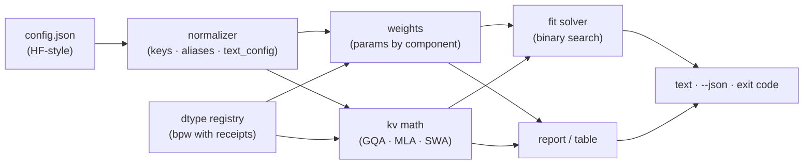

# kvcalc

[English](README.md) | [中文](README.zh.md) | [日本語](README.ja.md)

[](LICENSE)   [](CONTRIBUTING.md)

**config.json から任意のコンテキストとバッチにおける KV キャッシュと重みメモリを計算。オフライン動作、GQA・MLA 対応、スクリプト可能、ユニットテスト済み。**


```bash
# not yet on npm — install from a checkout of this repository
npm install && npm run build && npm pack
npm install -g ./kvcalc-0.1.0.tgz
```

## なぜ kvcalc？

「128k コンテキストは 24GB に収まる？」はローカル LLM フォーラムで毎日聞かれる質問なのに、答えはいつも民間伝承だ：密な MHA 時代の経験則、Web 計算機のスクリーンショット、うろ覚えのスプレッドシート。本当の計算は知り得るもので——各項はモデルの `config.json` にすべて書いてある——だがアーキテクチャ形状の落とし穴が潜んでいる。GQA はヘッドのグループ化係数でキャッシュを割る；MLA モデルはヘッドごとの K/V を一切キャッシュせず圧縮された潜在ベクトルをキャッシュするため、汎用公式は一桁過大評価する；スライディングウィンドウ層はウィンドウを超えると増えなくなる；MoE モデルは総パラメータとアクティブパラメータに分かれる。最も近い Web 計算機はオンラインで（設定が他人のサーバーに送られる、あるいはエアギャップ環境では使えない）、近似的で（密時代の公式、丸められた重みあたりビット数）、スクリプト化もできない。kvcalc は欠けていたローカルの原始関数だ：`config.json` を指せば、形状から厳密に導いた数字——コンポーネント別の重み、トークンあたりキャッシュ、任意のコンテキストとバッチでの合計、予算に収まる最大コンテキスト——が整列テーブルまたは JSON で得られ、スクリプトが判断できる終了コードも付く。アカウント不要、アップロードなし、ソケットは永遠に開かない。

| | kvcalc | ホスト型 VRAM 計算機 | `accelerate` メモリ推定 | スプレッドシート伝承 |
|---|---|---|---|---|
| 完全オフライン動作、設定はディスクを出ない | ✅ | ❌ ブラウザ + 先方サーバー | ❌ Hub から取得 | ✅ |
| MLA 圧縮キャッシュの公式 | ✅ | ❌ 良くて GQA 計算 | ❌ 重みのみ | ❌ |
| スライディングウィンドウ層を層ごとにキャップ | ✅ | ❌ | ❌ | ❌ |
| MoE の総パラメータ vs アクティブ | ✅ 両方 | 🟡 まれに | ✅ 総量のみ | 🟡 自前で維持 |
| ブロック量子化 bpw をブロック配置から導出（q8_0 = 8.5） | ✅ 厳密 | 🟡 丸め | ❌ | 🟡 大抵 8.0 |
| 任意の ctx × batch の KV キャッシュ、最大 ctx の逆算 | ✅ | 🟡 固定プリセット | ❌ KV なし | 🟡 手計算 |
| スクリプト可能：JSON 出力 + 終了コードゲート | ✅ | ❌ | 🟡 テキスト | ❌ |
| ランタイム依存ゼロ | ✅ | — | ❌ Python スタック一式 | — |

<sub>各ツール群の公開挙動との比較、2026-07。kvcalc は形状から重み + KV キャッシュを計算する；ランタイムオーバーヘッド（CUDA コンテキスト、アクティベーション、断片化）は明示的に対象外——`--overhead` で確保する。全公式と誠実な限界は [docs/kv-math.md](docs/kv-math.md) を参照。</sub>

## 特徴

- **雰囲気ではなく答えを** — `kvcalc report config.json --ctx 128k --vram 24GiB` が重み、キャッシュ、合計、そして FITS / DOES NOT FIT の判定を符号付き余裕とともに出力。経験則ではなくテンソル形状から計算する。
- **答えが変わる箇所でアーキテクチャを認識** — GQA のヘッドグループ化、MLA の潜在キャッシュ（層ごとに `kv_lora_rank + qk_rope_head_dim`、ヘッドごとの K/V ではない）、スライディングウィンドウ層の `min(ctx, window)` キャップ、MoE のルーティング/共有エキスパートと総・アクティブ両方のパラメータ。
- **名前ではなくキー駆動** — kvcalc は設定キー（`num_key_value_heads`、`kv_lora_rank`、`layer_types`、`text_config`……）を読み、モデル名は一切照合しない。キーを再利用する新モデルはリリース当日から動く。
- **重みあたりビット数に根拠を** — ブロック量子化のサイズはブロック配置から導出（q4_0 = 32 重みあたり 18 バイト = 厳密に 4.5 bpw）；q4_K_M のような混合プリセットは実測平均で `~` 付き。`kvcalc dtypes` が全表を出力。
- **逆問題も解く** — `kvcalc fit --vram 24GiB` がバッチ、重み精度、キャッシュ精度、オーバーヘッドの下でちょうど収まる最大コンテキストを二分探索し、モデルのフルコンテキストが収まるかも報告する。
- **スクリプトのために** — 全コマンドに `--json`、同一入力にはバイト単位で同一の出力、終了コード 0（収まる）/ 1（予算チェック不合格）/ 2（用法エラー）、警告は stderr のみ。
- **ランタイム依存ゼロ、完全オフライン** — 必要なのは Node.js だけ；kvcalc はソケットを開かず、`typescript` が唯一の devDependency。

## クイックスタート

同梱の 8B 級 GQA サンプルで、あの毎日の質問に答える：

```bash
kvcalc report examples/gqa-8b.json --ctx 128k --weights q4_K_M --vram 24GiB
```

出力（実際のキャプチャ）：

```text
kvcalc 0.1.0 — memory report

model     examples/gqa-8b.json
arch      32 layers · GQA 32q/8kv · head_dim 128 · max ctx 131072
params    8.03 B
          embed 525.34 M · attn 1.34 B · mlp 5.64 B · head 525.34 M

weights   q4_K_M     4.53 GiB   8.03 B × 4.85 bpw (~)
kv cache  fp16      16.00 GiB   ctx 131072 × batch 1 × 128.00 KiB/token
total               20.53 GiB

budget    24.00 GiB → FITS   (headroom 3.47 GiB)
```

終了コード 0——つまり、q4_K_M なら 128k は 24GB に収まる。起動スクリプトのゲートにも使える。コンテキストのグリッドを掃引することも（実際のキャプチャ）：

```bash
kvcalc table examples/gqa-8b.json --weights q4_K_M --ctx-list 8k,32k,128k --vram 24GiB
```

```text
kvcalc 0.1.0 — memory table

model     examples/gqa-8b.json · weights q4_K_M = 4.53 GiB · batch 1 · budget 24.00 GiB

     ctx         kv fp16         kv q8_0         kv q4_0
      8k      5.53 GiB ✓      5.07 GiB ✓      4.82 GiB ✓
     32k      8.53 GiB ✓      6.66 GiB ✓      5.66 GiB ✓
    128k     20.53 GiB ✓     13.03 GiB ✓      9.03 GiB ✓

cells are weights + kv (+ overhead); ✓/✗ compare against --vram
```

逆の質問——q8_0 重み、batch 4、ランタイムに 1 GiB を確保したとき、24GiB のカードでどれだけのコンテキストが買えるか（実際のキャプチャ；終了コード 0——`fit` が 1 で終了するのは何も収まらないときだけ）：

```bash
kvcalc fit examples/gqa-8b.json --vram 24GiB --weights q8_0 --batch 4 --overhead 1GiB
```

```text
kvcalc 0.1.0 — fit 24.00 GiB

model     examples/gqa-8b.json
weights   q8_0       7.95 GiB
overhead             1.00 GiB
kv        fp16     128.00 KiB/token × batch 4
kv budget           15.05 GiB

max ctx   30830 tokens at batch 4, kv 15.05 GiB
model max 131072 (128k) → full model context DOES NOT FIT
```

MLA・スライディングウィンドウ・MoE のサンプルは [examples/](examples/README.md) に、全公式は [docs/kv-math.md](docs/kv-math.md) に書き下してある。

## コマンド

| コマンド | 役割 | 主なオプション |
|---|---|---|
| `report <config>` | 単一の (ctx, batch) 点でのメモリ、任意で判定 | `--ctx`、`--batch`、`--weights`、`--kv`、`--vram`、`--json` |
| `table <config>` | ctx × kv 精度グリッドの合計、✓/✗ マーク | `--ctx-list`、`--kv-list`、`--vram`、`--json` |
| `fit <config>` | 予算に収まる最大 ctx | `--vram`（必須）、`--overhead`、`--batch`、`--json` |
| `dtypes` | 出典付き重みあたりビット数リファレンス | `--json` |

サイズは `24GiB`、`512MiB` を受け付け——`24GB` は GiB として読む。GPU のスペック表がそういう意味だからだ。コンテキスト長は `128k` = 131072。終了コードはスクリプト向け：`0` 正常/収まる、`1` いずれかの `--vram` チェック不合格、`2` 用法または設定エラー。

## 1 トークンのコスト

| アテンション | 層ごと・トークンごとのキャッシュ量 | 例（fp16） |
|---|---|---|
| MHA | `2 · heads · head_dim` | 密時代の 7B：512 KiB/token |
| GQA | `2 · kv_heads · head_dim` | 同梱 8B（32q/8kv）：128 KiB/token |
| MLA | `kv_lora_rank + qk_rope_head_dim` | 同梱 236B（128 ヘッド！）：67.5 KiB/token |

これに層数、コンテキスト、バッチ、キャッシュ精度のビット数を掛ければキャッシュの全てだ。スライディングウィンドウ層は `ctx` を `min(ctx, window)` に置き換える。この表こそ、アーキテクチャを見ない計算機がどちらの方向にも 10 倍間違い得る理由である。

## アーキテクチャ



## ロードマップ

- [x] キー駆動の設定正規化（GQA/MLA/MoE/SWA/`text_config`）、厳密なパラメータ計数、層ごとの KV 計算、fit ソルバー、根拠付き dtype レジストリ、JSON + 終了コード契約、87 テスト + スモークスクリプト（v0.1.0）
- [ ] `--lora <rank>` 項：アダプタ重みとオプティマイザ不要なファインチューンの占有量
- [ ] 指定チャンクサイズでの prefill アクティベーションメモリ上界
- [ ] マルチ GPU 分割：テンソル並列シャーディング下のデバイス別合計
- [ ] ローカルの safetensors/GGUF ヘッダから形状を直接読むクロスチェック
- [ ] マルチモーダル設定のビジョンタワー計上（現状はテキストのみ）
- [ ] npm への公開

全リストは [open issues](https://github.com/JaydenCJ/kvcalc/issues) を参照。

## コントリビュート

コントリビュート歓迎。`npm install && npm run build` でビルドし、`npm test` と `bash scripts/smoke.sh`（`SMOKE OK` を出力すること）を実行——このリポジトリは CI を持たず、上記の全主張はローカル実行で検証される。[CONTRIBUTING.md](CONTRIBUTING.md) を読み、[good first issue](https://github.com/JaydenCJ/kvcalc/issues?q=is%3Aissue+is%3Aopen+label%3A%22good+first+issue%22) を拾うか、[discussion](https://github.com/JaydenCJ/kvcalc/discussions) を始めよう。

## ライセンス

[MIT](LICENSE)
