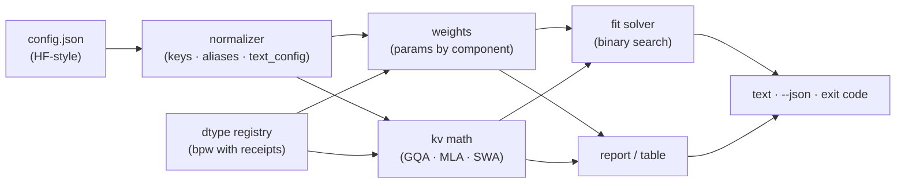

# kvcalc

[English](README.md) | [中文](README.zh.md) | [日本語](README.ja.md)

[](LICENSE)   [](CONTRIBUTING.md)

**Computes KV-cache and weight memory from config.json for any context and batch. Offline, GQA- and MLA-aware, scriptable, unit-tested.**


```bash
# not yet on npm — install from a checkout of this repository
npm install && npm run build && npm pack
npm install -g ./kvcalc-0.1.0.tgz
```

## Why kvcalc?

"Will 128k context fit in 24GB?" gets asked daily on local-LLM forums, and the answers are folklore: a rule of thumb from the dense-MHA era, a screenshot of a web calculator, a spreadsheet someone half-remembers. The actual arithmetic is knowable — every term is right there in the model's `config.json` — but it has architecture-shaped trapdoors. GQA divides the cache by the head-grouping factor; MLA models don't cache per-head K/V at all, they cache a compressed latent, so the generic formula overestimates them by an order of magnitude; sliding-window layers stop growing past their window; MoE models split into total and active parameters. The web calculators that come closest are online (your config goes to someone's server, or the tool is unusable on an air-gapped box), approximate (dense-era formulas, rounded bits-per-weight), and unscriptable. kvcalc is the missing local primitive: point it at a `config.json`, get exact shape-derived numbers — weights by component, cache per token, totals for any context and batch, the largest context a budget can hold — as aligned tables or JSON, with an exit code your scripts can act on. No account, no upload, no socket — ever.

| | kvcalc | Hosted VRAM calculators | `accelerate` memory estimator | Spreadsheet folklore |
|---|---|---|---|---|
| Runs fully offline, config never leaves disk | ✅ | ❌ browser + their server | ❌ pulls from the Hub | ✅ |
| MLA compressed-cache formula | ✅ | ❌ GQA math at best | ❌ weights only | ❌ |
| Sliding-window layers capped per layer | ✅ | ❌ | ❌ | ❌ |
| MoE total vs active parameters | ✅ both | 🟡 sometimes | ✅ total | 🟡 you maintain it |
| Block-quant bpw from block layouts (q8_0 = 8.5) | ✅ exact | 🟡 rounded | ❌ | 🟡 usually 8.0 |
| KV cache for *any* ctx × batch, solve for max ctx | ✅ | 🟡 fixed presets | ❌ no KV at all | 🟡 by hand |
| Scriptable: JSON output + exit-code gate | ✅ | ❌ | 🟡 text | ❌ |
| Zero runtime dependencies | ✅ | — | ❌ full Python stack | — |

<sub>Comparison against each tool class's public behavior, 2026-07. kvcalc computes weights + KV cache from shapes; runtime overhead (CUDA context, activations, fragmentation) is explicitly out of scope — budget it with `--overhead`. See [docs/kv-math.md](docs/kv-math.md) for every formula and honest limits.</sub>

## Features

- **The answer, not a vibe** — `kvcalc report config.json --ctx 128k --vram 24GiB` prints weights, cache, total and a FITS / DOES NOT FIT verdict with signed headroom, computed from tensor shapes, not rules of thumb.
- **Architecture-aware where it changes the answer** — GQA head grouping, MLA latent caching (`kv_lora_rank + qk_rope_head_dim` per layer, not per-head K/V), sliding-window layers capped at `min(ctx, window)` per layer, MoE routed/shared experts with total *and* active params.
- **Key-driven, not name-driven** — kvcalc reads config keys (`num_key_value_heads`, `kv_lora_rank`, `layer_types`, `text_config`, …) and never matches model names, so new models that reuse the keys work the day they drop.
- **Bits-per-weight with receipts** — block-quant sizes derive from the block layouts (q4_0 = 18 bytes per 32 weights = 4.5 bpw exactly); mixed presets like q4_K_M carry a measured average and are marked `~`. `kvcalc dtypes` prints the whole table.
- **Solves the inverse problem too** — `kvcalc fit --vram 24GiB` binary-searches the exact largest context that fits at your batch, weight dtype, cache dtype and overhead, and says whether the model's full context fits.
- **Built for scripts** — `--json` on every command, byte-identical output for identical inputs, exit codes 0 (fits) / 1 (budget check failed) / 2 (usage error), warnings on stderr only.
- **Zero runtime dependencies, fully offline** — Node.js is the only requirement; kvcalc never opens a socket, and `typescript` is the sole devDependency.

## Quickstart

The daily question, against the bundled 8B-class GQA example:

```bash
kvcalc report examples/gqa-8b.json --ctx 128k --weights q4_K_M --vram 24GiB
```

Output (real captured run):

```text
kvcalc 0.1.0 — memory report

model     examples/gqa-8b.json
arch      32 layers · GQA 32q/8kv · head_dim 128 · max ctx 131072
params    8.03 B
          embed 525.34 M · attn 1.34 B · mlp 5.64 B · head 525.34 M

weights   q4_K_M     4.53 GiB   8.03 B × 4.85 bpw (~)
kv cache  fp16      16.00 GiB   ctx 131072 × batch 1 × 128.00 KiB/token
total               20.53 GiB

budget    24.00 GiB → FITS   (headroom 3.47 GiB)
```

Exit code 0 — so yes, 128k fits in 24GB at q4_K_M, and you can gate a launch script on it. Or sweep a context grid (real captured run):

```bash
kvcalc table examples/gqa-8b.json --weights q4_K_M --ctx-list 8k,32k,128k --vram 24GiB
```

```text
kvcalc 0.1.0 — memory table

model     examples/gqa-8b.json · weights q4_K_M = 4.53 GiB · batch 1 · budget 24.00 GiB

     ctx         kv fp16         kv q8_0         kv q4_0
      8k      5.53 GiB ✓      5.07 GiB ✓      4.82 GiB ✓
     32k      8.53 GiB ✓      6.66 GiB ✓      5.66 GiB ✓
    128k     20.53 GiB ✓     13.03 GiB ✓      9.03 GiB ✓

cells are weights + kv (+ overhead); ✓/✗ compare against --vram
```

The inverse question — how much context does a 24GiB card buy at q8_0 weights, batch 4, with 1 GiB reserved for the runtime (real captured run; exit code 0 — `fit` exits 1 only when nothing fits):

```bash
kvcalc fit examples/gqa-8b.json --vram 24GiB --weights q8_0 --batch 4 --overhead 1GiB
```

```text
kvcalc 0.1.0 — fit 24.00 GiB

model     examples/gqa-8b.json
weights   q8_0       7.95 GiB
overhead             1.00 GiB
kv        fp16     128.00 KiB/token × batch 4
kv budget           15.05 GiB

max ctx   30830 tokens at batch 4, kv 15.05 GiB
model max 131072 (128k) → full model context DOES NOT FIT
```

MLA, sliding-window and MoE examples live in [examples/](examples/README.md); every formula is written out in [docs/kv-math.md](docs/kv-math.md).

## Commands

| Command | Does | Key options |
|---|---|---|
| `report <config>` | memory at one (ctx, batch) point, optional verdict | `--ctx`, `--batch`, `--weights`, `--kv`, `--vram`, `--json` |
| `table <config>` | totals across a ctx × kv-dtype grid, ✓/✗ marks | `--ctx-list`, `--kv-list`, `--vram`, `--json` |
| `fit <config>` | largest ctx that fits a budget | `--vram` (required), `--overhead`, `--batch`, `--json` |
| `dtypes` | bits-per-weight reference with provenance | `--json` |

Sizes accept `24GiB`, `512MiB` — and `24GB` is read as GiB, because that is what GPU spec sheets mean. Context lengths accept `128k` = 131072. Exit codes are script-friendly: `0` ok/fits, `1` a `--vram` check failed, `2` usage or config error.

## What one token costs

| Attention | Cached per layer per token | Example (fp16) |
|---|---|---|
| MHA | `2 · heads · head_dim` | 7B dense-era: 512 KiB/token |
| GQA | `2 · kv_heads · head_dim` | bundled 8B (32q/8kv): 128 KiB/token |
| MLA | `kv_lora_rank + qk_rope_head_dim` | bundled 236B (128 heads!): 67.5 KiB/token |

Multiply by layers, context, batch and cache-dtype bits — that's the whole cache. Sliding-window layers swap `ctx` for `min(ctx, window)`. This table is why an architecture-blind calculator can be wrong by 10× in either direction.

## Architecture



## Roadmap

- [x] Key-driven config normalizer (GQA/MLA/MoE/SWA/`text_config`), exact param counting, per-layer KV math, fit solver, dtype registry with receipts, JSON + exit-code contract, 87 tests + smoke script (v0.1.0)
- [ ] `--lora <rank>` term for adapter weights and optimizer-free fine-tune footprints
- [ ] Activation-memory upper bound for prefill at a given chunk size
- [ ] Multi-GPU splits: per-device totals under tensor-parallel sharding
- [ ] Read shapes directly from local safetensors/GGUF headers as a cross-check
- [ ] Vision-tower accounting for multimodal configs (currently text-only)
- [ ] Publish to npm

See the [open issues](https://github.com/JaydenCJ/kvcalc/issues) for the full list.

## Contributing

Contributions are welcome. Build with `npm install && npm run build`, then run `npm test` and `bash scripts/smoke.sh` (must print `SMOKE OK`) — this repository ships no CI, every claim above is verified by local runs. See [CONTRIBUTING.md](CONTRIBUTING.md), grab a [good first issue](https://github.com/JaydenCJ/kvcalc/issues?q=is%3Aissue+is%3Aopen+label%3A%22good+first+issue%22), or start a [discussion](https://github.com/JaydenCJ/kvcalc/discussions).

## License

[MIT](LICENSE)
