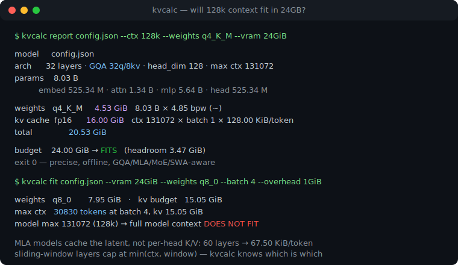
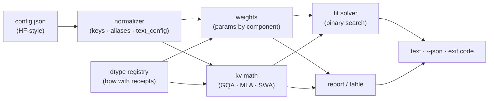

# kvcalc

[English](README.md) | [中文](README.zh.md) | [日本語](README.ja.md)

[](LICENSE)   [](CONTRIBUTING.md)

**从 config.json 精确计算任意上下文与批量下的 KV 缓存和权重显存。离线运行，感知 GQA 与 MLA，可脚本化，充分单测。**



```bash
# not yet on npm — install from a checkout of this repository
npm install && npm run build && npm pack
npm install -g ./kvcalc-0.1.0.tgz
```

## 为什么选 kvcalc？

"128k 上下文能塞进 24GB 吗？"是本地 LLM 论坛每天都在问的问题，而答案往往是民间传说：稠密 MHA 时代的经验公式、某个网页计算器的截图、一份半记不清的电子表格。真正的算术是可知的——每一项都写在模型的 `config.json` 里——但其中埋着与架构形状相关的陷阱。GQA 按头分组因子缩小缓存；MLA 模型根本不缓存逐头的 K/V，而是缓存压缩后的潜向量，通用公式会高估一个数量级；滑动窗口层超过窗口后不再增长；MoE 模型分为总参数与激活参数。最接近的网页计算器都是在线的（你的配置会发到别人的服务器，或者在离线机器上根本没法用）、近似的（稠密时代公式、四舍五入的每权重位数）、且无法脚本化的。kvcalc 是缺失的那个本地原语：指向一个 `config.json`，得到由形状精确推导的数字——按组件拆分的权重、每 token 缓存、任意上下文与批量下的总量、给定预算能容纳的最大上下文——以对齐表格或 JSON 输出，附带脚本可用的退出码。没有账号、没有上传、永远不开 socket。

| | kvcalc | 在线显存计算器 | `accelerate` 内存估算器 | 电子表格民间传说 |
|---|---|---|---|---|
| 完全离线运行，配置不离开磁盘 | ✅ | ❌ 浏览器 + 对方服务器 | ❌ 从 Hub 拉取 | ✅ |
| MLA 压缩缓存公式 | ✅ | ❌ 最多按 GQA 算 | ❌ 只算权重 | ❌ |
| 滑动窗口层逐层封顶 | ✅ | ❌ | ❌ | ❌ |
| MoE 总参数 vs 激活参数 | ✅ 两者都有 | 🟡 偶尔 | ✅ 仅总量 | 🟡 靠自己维护 |
| 块量化 bpw 源自块布局（q8_0 = 8.5） | ✅ 精确 | 🟡 四舍五入 | ❌ | 🟡 通常按 8.0 |
| 任意 ctx × batch 的 KV 缓存，反解最大 ctx | ✅ | 🟡 固定预设 | ❌ 完全没有 KV | 🟡 手算 |
| 可脚本化：JSON 输出 + 退出码门禁 | ✅ | ❌ | 🟡 文本 | ❌ |
| 零运行时依赖 | ✅ | — | ❌ 整套 Python 栈 | — |

<sub>与各工具类别公开行为的对比，2026-07。kvcalc 从形状计算权重 + KV 缓存；运行时开销（CUDA 上下文、激活、碎片）明确不在范围内——用 `--overhead` 预留。所有公式与诚实的局限见 [docs/kv-math.md](docs/kv-math.md)。</sub>

## 特性

- **给答案，不给感觉** — `kvcalc report config.json --ctx 128k --vram 24GiB` 打印权重、缓存、总量以及 FITS / DOES NOT FIT 的判定和带符号的余量，全部由张量形状算出，不靠经验法则。
- **在改变答案的地方感知架构** — GQA 头分组、MLA 潜向量缓存（每层缓存 `kv_lora_rank + qk_rope_head_dim`，而非逐头 K/V）、滑动窗口层逐层按 `min(ctx, window)` 封顶、MoE 路由/共享专家并给出总参数*和*激活参数。
- **按键驱动，不按名字驱动** — kvcalc 读配置键（`num_key_value_heads`、`kv_lora_rank`、`layer_types`、`text_config`……），从不匹配模型名字，复用这些键的新模型发布当天即可使用。
- **每权重位数有凭有据** — 块量化大小由块布局推导（q4_0 = 每 32 个权重 18 字节 = 精确 4.5 bpw）；q4_K_M 这类混合预设采用实测平均值并标注 `~`。`kvcalc dtypes` 打印完整表格。
- **也解反问题** — `kvcalc fit --vram 24GiB` 在你的批量、权重精度、缓存精度与开销下二分搜索出恰好放得下的最大上下文，并说明模型的完整上下文是否放得下。
- **为脚本而生** — 每个命令都有 `--json`，相同输入字节级一致的输出，退出码 0（放得下）/ 1（预算检查未通过）/ 2（用法错误），警告只走 stderr。
- **零运行时依赖，完全离线** — 只需要 Node.js；kvcalc 从不打开 socket，`typescript` 是唯一的 devDependency。

## 快速上手

用内置的 8B 级 GQA 示例回答那个每日之问：

```bash
kvcalc report examples/gqa-8b.json --ctx 128k --weights q4_K_M --vram 24GiB
```

输出（真实捕获）：

```text
kvcalc 0.1.0 — memory report

model     examples/gqa-8b.json
arch      32 layers · GQA 32q/8kv · head_dim 128 · max ctx 131072
params    8.03 B
          embed 525.34 M · attn 1.34 B · mlp 5.64 B · head 525.34 M

weights   q4_K_M     4.53 GiB   8.03 B × 4.85 bpw (~)
kv cache  fp16      16.00 GiB   ctx 131072 × batch 1 × 128.00 KiB/token
total               20.53 GiB

budget    24.00 GiB → FITS   (headroom 3.47 GiB)
```

退出码 0——所以是的，q4_K_M 下 128k 能塞进 24GB，你可以用它做启动脚本的门禁。也可以扫一个上下文网格（真实捕获）：

```bash
kvcalc table examples/gqa-8b.json --weights q4_K_M --ctx-list 8k,32k,128k --vram 24GiB
```

```text
kvcalc 0.1.0 — memory table

model     examples/gqa-8b.json · weights q4_K_M = 4.53 GiB · batch 1 · budget 24.00 GiB

     ctx         kv fp16         kv q8_0         kv q4_0
      8k      5.53 GiB ✓      5.07 GiB ✓      4.82 GiB ✓
     32k      8.53 GiB ✓      6.66 GiB ✓      5.66 GiB ✓
    128k     20.53 GiB ✓     13.03 GiB ✓      9.03 GiB ✓

cells are weights + kv (+ overhead); ✓/✗ compare against --vram
```

反过来问——q8_0 权重、batch 4、给运行时预留 1 GiB 时，24GiB 显卡能买到多少上下文（真实捕获；退出码 0——`fit` 只在什么都放不下时才退出 1）：

```bash
kvcalc fit examples/gqa-8b.json --vram 24GiB --weights q8_0 --batch 4 --overhead 1GiB
```

```text
kvcalc 0.1.0 — fit 24.00 GiB

model     examples/gqa-8b.json
weights   q8_0       7.95 GiB
overhead             1.00 GiB
kv        fp16     128.00 KiB/token × batch 4
kv budget           15.05 GiB

max ctx   30830 tokens at batch 4, kv 15.05 GiB
model max 131072 (128k) → full model context DOES NOT FIT
```

MLA、滑动窗口与 MoE 示例见 [examples/](examples/README.md)；每个公式都写在 [docs/kv-math.md](docs/kv-math.md) 里。

## 命令

| 命令 | 作用 | 关键选项 |
|---|---|---|
| `report <config>` | 单个 (ctx, batch) 点的显存，可选判定 | `--ctx`、`--batch`、`--weights`、`--kv`、`--vram`、`--json` |
| `table <config>` | ctx × kv 精度网格的总量，✓/✗ 标记 | `--ctx-list`、`--kv-list`、`--vram`、`--json` |
| `fit <config>` | 预算内放得下的最大 ctx | `--vram`（必填）、`--overhead`、`--batch`、`--json` |
| `dtypes` | 每权重位数参考表，附出处 | `--json` |

大小接受 `24GiB`、`512MiB`——`24GB` 按 GiB 解读，因为 GPU 规格表就是这个意思。上下文长度接受 `128k` = 131072。退出码对脚本友好：`0` 正常/放得下，`1` 某个 `--vram` 检查未通过，`2` 用法或配置错误。

## 一个 token 值多少

| 注意力 | 每层每 token 缓存量 | 示例（fp16） |
|---|---|---|
| MHA | `2 · heads · head_dim` | 稠密时代 7B：512 KiB/token |
| GQA | `2 · kv_heads · head_dim` | 内置 8B（32q/8kv）：128 KiB/token |
| MLA | `kv_lora_rank + qk_rope_head_dim` | 内置 236B（128 个头！）：67.5 KiB/token |

乘以层数、上下文、批量和缓存精度位数——这就是全部缓存。滑动窗口层把 `ctx` 换成 `min(ctx, window)`。这张表就是架构盲计算器可能双向错 10 倍的原因。

## 架构



## 路线图

- [x] 按键驱动的配置规范化（GQA/MLA/MoE/SWA/`text_config`）、精确参数统计、逐层 KV 计算、fit 求解器、有凭据的 dtype 注册表、JSON + 退出码契约、87 个测试 + 冒烟脚本（v0.1.0）
- [ ] `--lora <rank>` 项：适配器权重与免优化器微调的占用
- [ ] 给定分块大小下 prefill 激活显存的上界
- [ ] 多卡切分：张量并行分片下的逐设备总量
- [ ] 直接从本地 safetensors/GGUF 头读形状做交叉校验
- [ ] 多模态配置的视觉塔统计（当前仅文本）
- [ ] 发布到 npm

完整列表见 [open issues](https://github.com/JaydenCJ/kvcalc/issues)。

## 贡献

欢迎贡献。用 `npm install && npm run build` 构建，然后运行 `npm test` 和 `bash scripts/smoke.sh`（必须打印 `SMOKE OK`）——本仓库不带 CI，上面的每个断言都由本地运行验证。参阅 [CONTRIBUTING.md](CONTRIBUTING.md)，认领一个 [good first issue](https://github.com/JaydenCJ/kvcalc/issues?q=is%3Aissue+is%3Aopen+label%3A%22good+first+issue%22)，或发起一个 [discussion](https://github.com/JaydenCJ/kvcalc/discussions)。

## 许可证

[MIT](LICENSE)
